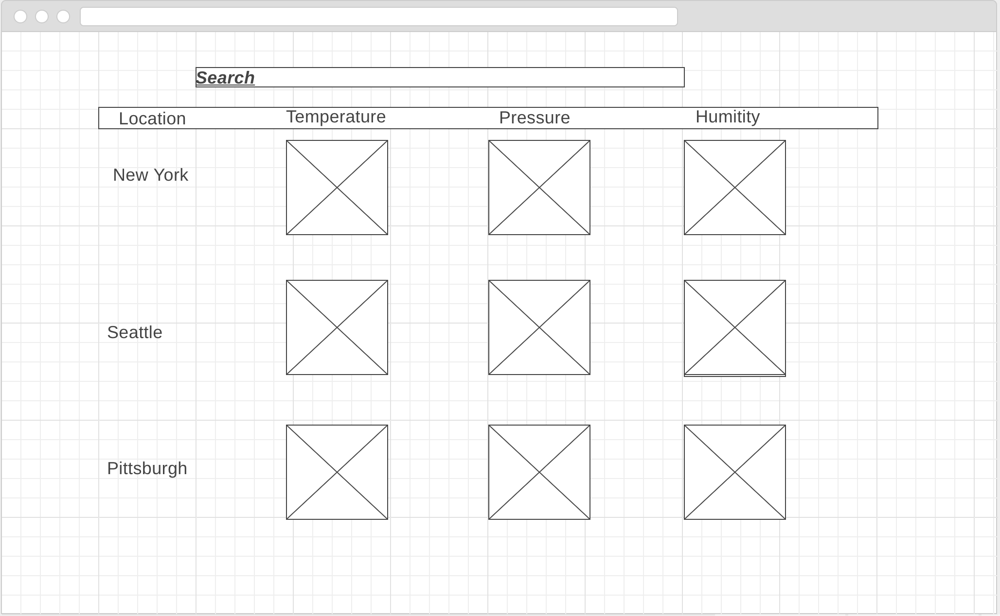

# npm "dependencies": 
```
    "jquery": "^3.3.1",
    "lodash": "^4.17.5",
    "react": "^16.2.0",
    "react-dom": "^16.2.0",
    "react-redux": "^5.0.6",
    "react-scripts": "1.1.1",
    "redux": "^3.7.2"
```
# reducer starter
```
import { combineReducers } from 'redux';

const rootReducer = combineReducers({
  state: (state = {}) => state
});

export default rootReducer;
```
# wireFrame
<p align="center">
  
</p>
<!-- https://wireframe.cc/6b7aCr -->
